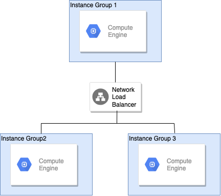

# Internal Load Balancer Example

This example creates 3 instance groups. The first group is in us-central1-b and uses the internal load balancer to proxy access to services running in instance groups 2 and 3 which exist in us-central1-c and us-central1-f respectively. A regional TCP load balancer is also used to forward external traffic to the instances in group 1.

**Figure 1.** *diagram of Google Cloud resources*



<!-- BEGINNING OF PRE-COMMIT-TERRAFORM DOCS HOOK -->
## Inputs

| Name | Description | Type | Default | Required |
|------|-------------|------|---------|:--------:|
| network | Name of the network to create resources in. | `string` | n/a | yes |
| project | The project id to deploy to | `string` | n/a | yes |
| region | Region for cloud resources. | `string` | n/a | yes |
| service\_account | Service account to attach to the instance. See https://www.terraform.io/docs/providers/google/r/compute_instance_template#service_account | <pre>object({<br>    email  = string<br>    scopes = set(string)<br>  })</pre> | n/a | yes |
| subnetwork | Name of the subnetwork to create resources in. | `string` | n/a | yes |
| subnetwork\_project | Name of the project for the subnetwork. Useful for shared VPC. | `string` | n/a | yes |

## Outputs

No outputs.

<!-- END OF PRE-COMMIT-TERRAFORM DOCS HOOK -->

## Set up the environment

```shell
gcloud auth application-default login
export GOOGLE_PROJECT=$(gcloud config get-value project)
```

## Run Terraform

```shell
terraform init
terraform plan
terraform apply
```

Open URL of load balancer in browser:

```shell
EXTERNAL_IP=$(terraform output -module gce-lb-fr external_ip)
open http://${EXTERNAL_IP}
```

You should see the instance details from `group2` proxied through `group1` and the internal load balancer.
